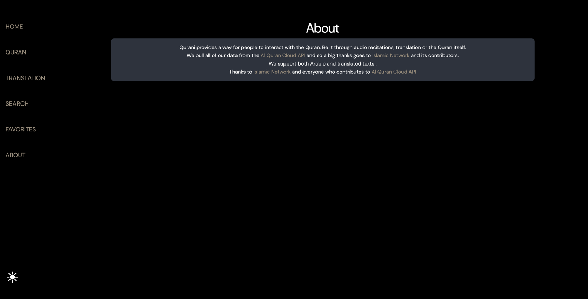

<h1>Qurani</h1>

Qurani is een interactieve SPA als opdracht voor het vak Web-Advanced. De applicatie biedt gebruikers de mogelijkheid om
surahs (hoofdstukken) en ayahs (verzen) uit de Koran te
ontdekken.
---

## Projectbeschrijving

De Qurani app laat gebruikers kennismaken met de structuur en inhoud van de Koran.

- Het biedt een random Ayah en Surah aan om je aan je dagelijkse lezen te houden
- Je kan surahs opzoeken op basis van hun revelatie plaats en in het Engels of Arabisch
- Favoriete surahs opslaan.
- De Koran doorzoeken op basis van een term in allerlei talen.

---

## Gebruikte API

- **Al-Quran API**: [https://alquran.cloud/api](https://alquran.cloud/api)

## Functionaliteiten

| Categorie                               | Locatie                                                                                                      |
|-----------------------------------------|--------------------------------------------------------------------------------------------------------------|
| Elementen selecteren                    | ```/src/api/surah.mjs``` op  ```line: 94```.                                                                 
| Elementen manipuleren                   | ```/src/api/surah.mjs```op ```line: 94```.                                                                   |
| Events aan elementen koppelen           | ```/src/pages/quran.mjs``` op ```line: 35```                                                                 |
| Gebruik van constanten                  | ```/src/api/ayah.mjs``` op ```line: 16```                                                                    |
| Template literals                       | ```/src/components/surah-of-the-day.mjs``` op ```line: 10```                                                 |
| Iteratie over arrays                    | ```/src/pages/quran.mjs``` op ```line: 58```                                                                 |
| Array methodes                          | ``` /src/components/favorites-list.mjs ``` op ```line: 25```                                                 |
| Arrow functions                         | ``` /src/pages/translation.mjs``` ```op line: 37```                                                          |
| Conditional (ternary) operator          | ``` /src/api/surah.mjs ``` op ```line: 95```                                                                 |
| Callback functions                      | ``` /src/api/surah.mjs``` op ```line: 115```                                                                 |
| Promises                                | ``` /src/api/ayah.mjs ``` op ```line: 70```                                                                  |
| Async & Await                           | ```/src/api/ayah.mjs ``` en ```/src/components/ayah-of-the-day.mjs``` op ```line: 38 ``` en op ```line: 6``` |
| Observer API (1 is voldoende)           | ```/src/utils/observer.mjs```                                                                                |
| Fetch om data op te halen               | ``` /src/api/keywords.mjs``` op ```line: 10 ```                                                              |
| JSON manipuleren en weergeven           | ```/src/api/surah.mjs ``` op ```line: 29-30```                                                               |
| Formulier validatie                     | ``` /src/pages/search.mjs``` op ```line: 28 ```                                                              |
| Gebruik van LocalStorage                | ```/src/utils/theme-utils.mjs``` ```line: 8```                                                               |
| Basis HTML layout (flexbox of grid)     | ```/src/style.css``` op ```line: 67```                                                                       |
| Basis CSS                               | ```/src/style.css ``` op ```line: 19 ```                                                                     |
| Gebruiksvriendelijke elementen          | ```/src/pages/quran.mjs ``` op ```line: 16```                                                                |
| Project is opgezet met Vite             | ```/package.json ```                                                                                         |
| Correcte folderstructuur (src, dist...) | ```/src/api``` ```/src/components``` ```...```                                                               |

---

## Installatiehandleiding

1. **Clone de repository**

   ```
    git clone https://github.com/nasrlol/Qurani.git
    cd Qurani
   ```

2. **Installeer dependencies**

   ```
   npm install
   ```

3. **Bouw het project**

   ```
   npm run build 
   ```

4. **Start de preview**

   ```
   npm run preview 
   ```
  
5. **Open in browser**
   Ga naar `http://localhost:5173`

---

## Screenshots

> Voeg hier enkele screenshots toe van:

* De homepagina met surah-lijst
* Pagina met lijst van Surahs in het Arabisch
* Pagina met lijst van Surahs in het Engels
* Zoek pagina naar termen
* Favorieten weergave
* Een about pagina dat een beetje verteld over de SPA
* Thema switcher




---

## Gebruikte bronnen

* https://alquran.cloud/api
* https://developer.mozilla.org/
* https://vitejs.dev/
* https://fonts.google.com/
* https://www.w3schools.com/js/js_promise.asp
* https://chatgpt.com/share/682f8942-edc0-8000-a350-d4f3ff4fb2eb
* https://chatgpt.com/c/6823501d-dfc0-8000-8646-7cd99b2628c1
* https://www.geeksforgeeks.org/observer-method-javascript-design-pattern/
* https://www.w3schools.com/js/js_callback.asp
* https://chatgpt.com/c/682f3ffd-35c4-8000-ae07-71fc2b3c7b0b
* https://chatgpt.com/c/6823111f-4ea8-8000-9f57-cdfc566a01b7

---

## Licentie

MIT License © 2025 nasrlol / Abdellah El Morabit
